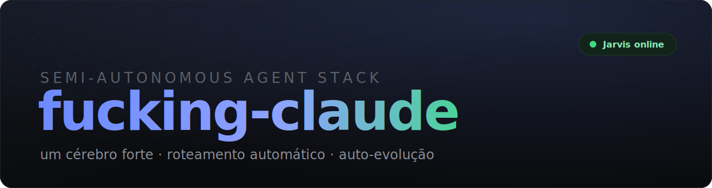

<p align="center">
  
</p>

<p align="center">
  <a href="#instalação-máquina-nova"></a>
  
  
  
</p>

<p align="center">
  <b><a href="#o-que-é-isto">O que é</a> · <a href="#as-4-camadas">Arquitetura</a> · <a href="#como-usar-o-menos-trabalho">Como usar</a> · <a href="#instalação-máquina-nova">Instalar</a> · <a href="#cérebros-o-que-roda-onde">Cérebros</a></b>
</p>

<p align="center"><em>Config de agentes semiautônoma sobre Claude Code. Um cérebro forte, roteamento automático, auto-evolução — e pouco trabalho pra você.</em></p>

---

## O que é isto

Não é mais um framework. É a **config de orquestração completa** que transforma o
Claude Code num operador semiautônomo (apelido: **Jarvis**): você fala o objetivo em
português normal e ele **dispara o especialista certo sozinho** — sem você lembrar
nome de agente.

Este repo **carrega o arsenal inteiro** e reproduz o setup numa máquina nova com um
comando. Sem secret, sem dado de cliente.

<p align="center">
  
  
  
  
</p>

## As 4 camadas

```
  ┌───────────────────────────────────────────────┐
  │  SKILL BUS  ~/.agents/skills                    │  fonte única, symlink em todo harness
  │  last30days · task-observer · find-skills       │
  └───────────────┬───────────────────┬────────────┘
        symlink ↙                       ↘ symlink
  ┌──────────────────────┐     ┌──────────────────────┐
  │  COCKPIT (Claude Code)│     │  SEMPRE-LIGADO        │
  │  cérebro: Opus 4.8    │     │  Hermes 24/7 + OpenWA │
  │  ECC 211 agents ·     │     │  cérebro: Gemini free │
  │  opensquad · impeccable│    │  ou Ollama (outro PC) │
  │  + JARVIS (roteador)  │     └──────────────────────┘
  └──────────────────────┘
```

1. **Skill bus** (`~/.agents/skills`) — uma skill instalada aqui aparece em **todo**
   harness (Claude Code, Hermes, Cursor…). `find-skills` é o gerenciador de pacotes;
   `task-observer` assiste tuas sessões e **melhora as skills sozinho**.
2. **Cockpit** — Claude Code pro trabalho pesado. Cérebro = Opus 4.8. Tem ECC (211
   agents), squads opensquad (copy/design/traffic/C-level…), `impeccable` (qualidade de UI).
3. **Jarvis** — a camada de roteamento (autoria própria): skill `jarvis` + hook de
   sessão. É o que torna semiautônomo.
4. **Sempre-ligado** — Hermes (agente 24/7 reachable pelo celular) + OpenWA (gateway
   WhatsApp). Cérebro grátis: Gemini (nuvem) ou Ollama local (num PC com GPU).

## Como usar (o "menos trabalho")

Fala o objetivo. O roteador escolhe e encadeia os especialistas:

| Você diz | Jarvis dispara |
|---|---|
| "faz um carrossel sobre X" | design-squad + copy-squad + `impeccable` |
| "analisa meus ads da semana" | traffic-masters + MCP Meta-ads |
| "o que tá bombando em educação" | `last30days` |
| "decisão estratégica sobre Y" | c-level-squad (vision-chief → C-levels) |
| "acha um bug aqui" | systematic-debugging + reviewer da linguagem |

Você nunca precisa saber o nome do agente. `/jarvis <pedido>` força o modo.

## Instalação (máquina nova)

```bash
git clone https://github.com/brebueno/fucking-claude.git
cd fucking-claude
bash install.sh          # instala TODOS os 211 agentes + skills + commands + rules + squads
bash install.sh --full   # + Hermes, OpenWA e impeccable (serviços externos)
```

O `install.sh` copia o arsenal inteiro pra `~/.claude` (e o skill bus pra `~/.agents/skills`). Depois, passos manuais opcionais:

- **CLAUDE.md** — cole o bloco de `config/CLAUDE.snippet.md` no seu.
- **Hermes** (opcional, 24/7) — `hermes setup` com cérebro grátis: ver [docs/hermes-ollama.md](docs/hermes-ollama.md).
- **OpenWA** (opcional, WhatsApp) — `cd ~/agent-stack/OpenWA && npm install && npm run dev`, escanear QR.

## Cérebros (o que roda onde)

| Onde | Cérebro | Custo |
|---|---|---|
| Claude Code (cockpit) | Opus 4.8 | assinatura Claude |
| Hermes em máquina fraca (ex: Mac 8GB) | Gemini via AI Studio | **grátis** (tier free) |
| Hermes em PC com GPU (ex: RTX 4060) | Ollama local (Qwen/Llama) | **grátis**, privado |

> Modelo local **não** precisa de conta nem chave — Qwen/Llama são open-weight, download grátis (`ollama pull`). Só exige GPU/RAM. Ver [docs/hermes-ollama.md](docs/hermes-ollama.md).

## Painel

`dashboard/index.html` — abre no navegador e mostra o stack + status ao vivo dos serviços.

## Arquivos

- `agents/` — 211 agentes (todos os que foram coletados, inclusive os antigos)
- `skills-claude/` — skills do Claude Code (ECC, superpowers, hm-*, catálogos…)
- `agents-skills/` — skill bus universal (find-skills, task-observer, last30days, jarvis)
- `commands/` — 92 slash commands
- `rules/` — rules ECC (por linguagem + comuns)
- `squads/` — 13 squads opensquad genéricos (copy, design, traffic, C-level…)
- `install.sh` — bootstrap (instala tudo; `--full` traz os serviços)
- `stack.yaml` — manifest · `hooks/jarvis-init.sh` — liga o Jarvis no boot
- `docs/` — guias (Hermes+Ollama, arquitetura)

## Créditos das peças de terceiros

Hermes ([nousresearch](https://github.com/nousresearch/hermes-agent)) ·
OpenWA ([rmyndharis](https://github.com/rmyndharis/OpenWA)) ·
impeccable ([pbakaus](https://github.com/pbakaus/impeccable)) ·
last30days ([mvanhorn](https://github.com/mvanhorn/last30days-skill)) ·
find-skills ([vercel-labs](https://github.com/vercel-labs/skills)) ·
task-observer ([rebelytics](https://github.com/rebelytics/one-skill-to-rule-them-all)) ·
skills ecosystem ([skills.sh](https://skills.sh))

## Licença

MIT — ver [LICENSE](LICENSE).
